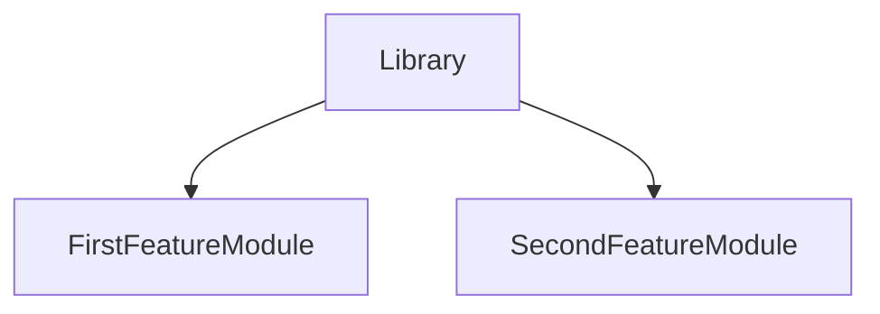

# DrinksApp

___ This project was generated with [Angular CLI](https://github.com/angular/angular-cli) version 15.0.4.

## Development server

___ Run npm i to install packages.
___ Run `ng serve` for a dev server. Navigate to `http://localhost:4200/`. 
___ The application will automatically reload if you change any of the source files.

## Design

___ Angular shared library
___ Ionic + Angular

